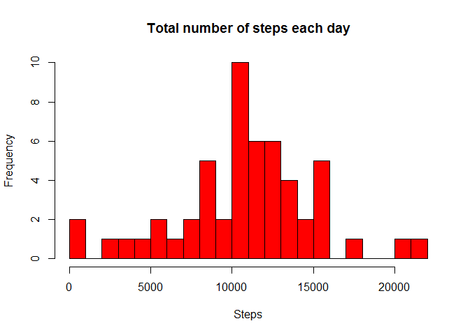
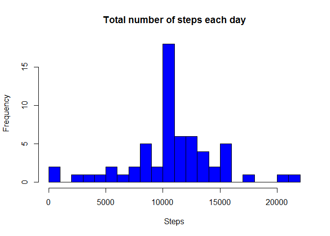
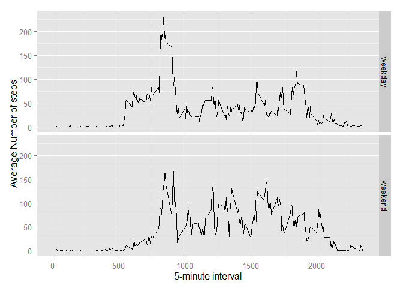

# Reproducible Research: Peer Assessment 1


## Loading and preprocessing the data
Show any code that is needed to

1. Load the data (i.e. `read.csv()`)


```r
#I like using tidyr and dplyr to clean data
library(tidyr)
library(dplyr)
```

```
## 
## Attaching package: 'dplyr'
## 
## The following objects are masked from 'package:stats':
## 
##     filter, lag
## 
## The following objects are masked from 'package:base':
## 
##     intersect, setdiff, setequal, union
```

```r
library(lubridate)
library(ggplot2)

df <- tbl_df(read.csv("activity.csv"))
```

#2. Process/transform the data (if necessary) into a format suitable for your analysis

```r
#Data set with the average by day.
df_day <- group_by(df, date)
df_day <- summarise(df_day, steps = sum(steps))

#Data set with the average by interval
df_int <- group_by(df, interval)
df_int <- df_int %>% filter(!is.na(steps))
df_int <- summarise(df_int, avgSteps = mean(steps))
```

## What is mean total number of steps taken per day?
For this part of the assignment, you can ignore the missing values in
the dataset.

1. Make a histogram of the total number of steps taken each day

```r
#lets create a histogram that looks pertty good!
hist(df_day$steps, breaks = 22, main = "Total number of steps each day", col = "red", xlab = "Steps")
```

 

2. Calculate and report the **mean** and **median** total number of steps taken per day

```r
mean(df_day$steps, na.rm = TRUE)
```

```
## [1] 10766.19
```

```r
median(df_day$steps, na.rm = TRUE)
```

```
## [1] 10765
```

## What is the average daily activity pattern?
1. Make a time series plot (i.e. `type = "l"`) of the 5-minute interval (x-axis) and the average number of steps taken, averaged across all days (y-axis)

```r
plot(df_int$interval, df_int$avgSteps, type="l", xlab = "Interval", ylab = "Average number of steps")
```

 

2. Which 5-minute interval, on average across all the days in the dataset, contains the maximum number of steps?

```r
filter(df_int, avgSteps == max(df_int$avgSteps))
```

```
## Source: local data frame [1 x 2]
## 
##   interval avgSteps
## 1      835 206.1698
```

## Imputing missing values
Note that there are a number of days/intervals where there are missing
values (coded as `NA`). The presence of missing days may introduce
bias into some calculations or summaries of the data.

1. Calculate and report the total number of missing values in the dataset (i.e. the total number of rows with `NA`s)

```r
sum(is.na(df$steps))
```

```
## [1] 2304
```

2. Devise a strategy for filling in all of the missing values in the dataset. The strategy does not need to be sophisticated. For example, you could use the mean/median for that day, or the mean for that 5-minute interval, etc.

```r
#I already have the means for each interval in df_int.
#filter out the na results
df_isna <- filter(df, is.na(steps))

#filter out the non NA results
df_good <- filter(df, !is.na(steps))
```

3. Create a new dataset that is equal to the original dataset but with the missing data filled in.

```r
#we can just join the mean steps to the df, them remove the extra columns
df_isna <- left_join(df_isna, df_int, by = "interval")
df_isna <- df_isna %>% select(avgSteps, date, interval) %>% rename(steps = avgSteps)

#merge the sets together again
df_new <- bind_rows(df_good, df_isna)
df_new <- arrange(df_new, date, interval)
```

4. Make a histogram of the total number of steps taken each day and Calculate and report the **mean** and **median** total number of steps taken per day. Do these values differ from the estimates from the first part of the assignment? What is the impact of imputing missing data on the estimates of the total daily number of steps?

```r
df_new_day <- df_new %>% group_by(date) %>% summarise(steps = sum(steps))
hist(df_new_day$steps, breaks = 22, main = "Total number of steps each day", col = "blue", xlab = "Steps")
```

 

```r
mean(df_new_day$steps, na.rm = TRUE)
```

```
## [1] 10766.19
```

```r
median(df_new_day$steps, na.rm = TRUE)
```

```
## [1] 10766.19
```

There was limited impact in the average data, because I use the mean to calculate the replacement data, however the histogram showed an increase in the mid-range values.

## Are there differences in activity patterns between weekdays and weekends?
For this part the `weekdays()` function may be of some help here. Use
the dataset with the filled-in missing values for this part.

1. Create a new factor variable in the dataset with two levels -- "weekday" and "weekend" indicating whether a given date is a weekday or weekend day.

```r
#Change the date to "POSIXct" "POSIXt"
df_new$date <- ymd(df_new$date)

#find the weekday.
df_new$weekday <- as.factor(weekdays(df_new$date))

#is it a weekend?
df_new$weekend <- as.factor(ifelse(df_new$weekday == "Saturday" | df_new$weekday == "Sunday", "weekend", "weekday"))
```

1. Make a panel plot containing a time series plot (i.e. `type = "l"`) of the 5-minute interval (x-axis) and the average number of steps taken, averaged across all weekday days or weekend days (y-axis).

```r
df_new_int <- df_new %>% group_by(interval, weekend) %>% summarise(avgSteps = mean(steps))

#I'm not sure how to make a pretty grpah of this in base plot, so I'll use ggplot2
ggplot(df_new_int, aes(interval, avgSteps)) + geom_line() + facet_grid(weekend ~ .) + xlab("5-minute interval") + ylab("Average Number of steps")
```

 
